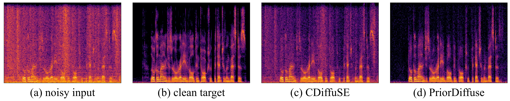

# Prior-DiffuSE

Our proposed method shows a significant improvement over existing DDPM-based speech enhancement algorithms, i.e., compared to CDiffuSE, the improvements over PESQ and SSNR are 21.72% and 88.49%, respectively.

## get started


1. modifie parameter in param.py(config in learner code) and diff.yml(args in learner code)
2. train
   1. train dis model only
       modified code
   2. train ddpm model only 
      1. move the trained dis model's ckp into the new asset folder
      2. train
         ```python
         python main.py --asset <asset_name> --retrain
         ```
   3. joint train
      ```python
      python main.py --asset <asset_name> --joint
      ```
3. draw evaluated data include noisy audio, init_audio, predicted_audio, true_delta, predicted_delta, save in the current floder
   ```python
    python main.py --asset <asset_name> -- retrain --draw
   ```
4. generate wav file 
   ```python
    python ./main.py --retrain --assets asset_priorDiffuse_sigma --sigma --joint --generate
   ```

## TODO list:

1. tuning DDPM hyperparameters
   1. lr: 1e-3 -> 2e-4
   2. lamdba: actually equals to learning rate at beginning
   3. x_init detached
   4. loss function: l1 loss -> com_mse_loss
   5. fast sampling: inference_noise_schedule0.5 -> 0.35 noise_schedule  0.05 -> 0.035 
2. create function which return X_init after model_dic, X - X_init and X after model_ddpm.
   1. draw_spectrum added by arg --draw
3. create function for drawing LS-MAE against Iteration.
4. added x_init metrics computing
